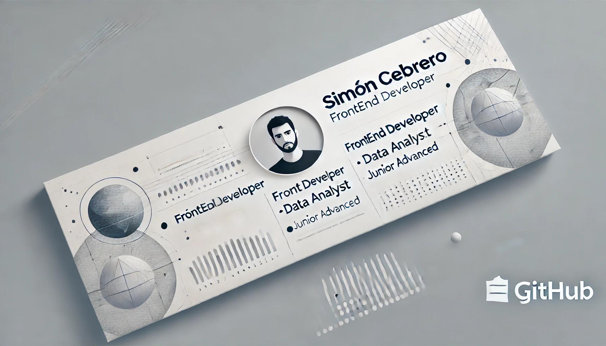

<h1 align="center">Hola, soy <a href="https://www.linkedin.com/in/sim%C3%B3n-cebrero-092191124/">Simón Cebrero</a> 👋</h1>

Soy una persona curiosa, comprometida y con ganas constantes de aprender. Me interesa todo lo relacionado con la tecnología y disfruto trabajar en equipo, resolver problemas y adaptarme a nuevos desafíos. Actualmente brindo soporte técnico y funcional en la Municipalidad de Malagueño, lo que me ha ayudado a fortalecer mis habilidades en atención al usuario, documentación y resolución de incidencias.
Participé activamente en el desarrollo e implementación de una solución basada en GLPI, encargándome de su investigación, capacitación de usuarios y puesta en marcha en un entorno de producción con servidor CPanel.
También trabajé como desarrollador frontend en la web de Rentas del gobierno de Córdoba, utilizando Angular, HTML y CSS, y aplicando metodologías ágiles como Scrum y Kanban.
 
 
 
I am a curious, committed person with a constant desire to learn. I am interested in everything related to technology and enjoy working in teams, solving problems, and adapting to new challenges. I currently provide technical and functional support for the Municipality of Malagueño, which has helped me strengthen my skills in customer service, documentation, and issue resolution.
I actively participated in the development and implementation of a GLPI-based solution, overseeing its research, user training, and implementation in a production environment with a CPanel server.
I also worked as a front-end developer on the Córdoba Government Revenue website, using Angular, HTML, and CSS, and applying agile methodologies such as Scrum and Kanban.

